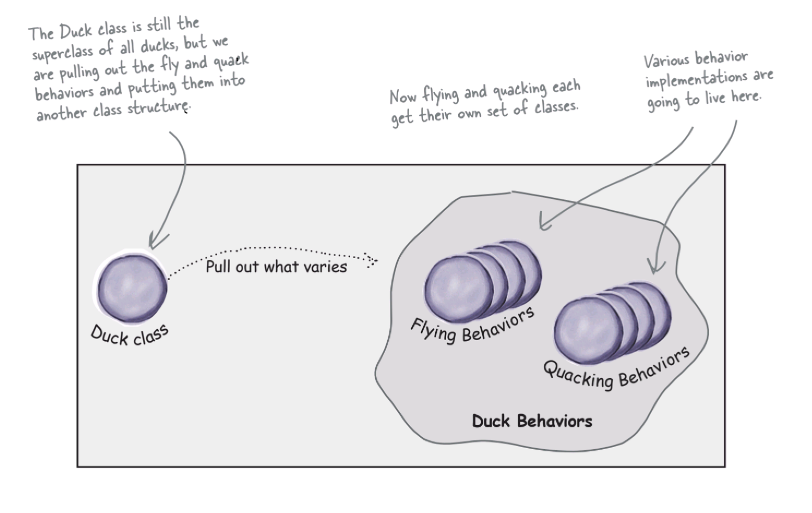
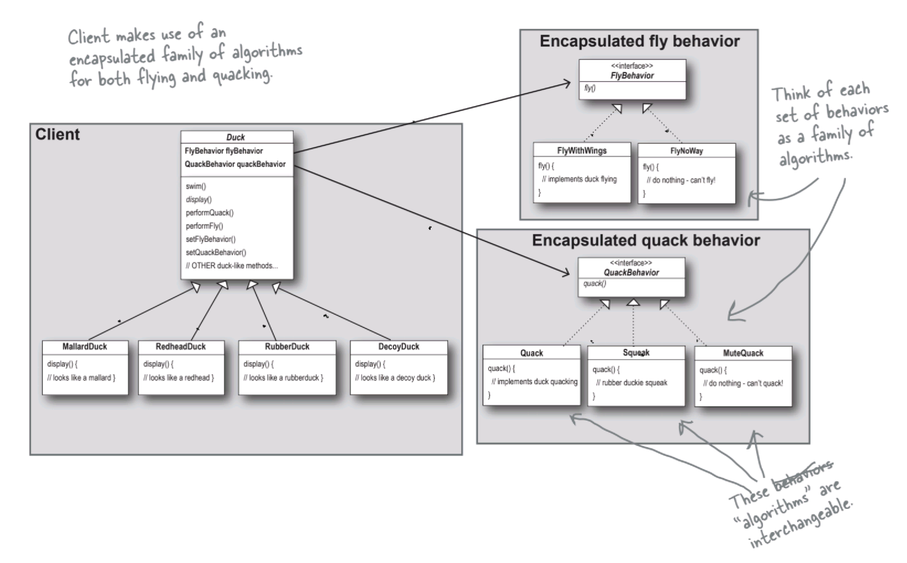

# Chapter 1: Strategy Pattern

- Behavioral design pattern.
- Enables selecting an algorithm at runtime.

## OO Basics

- **Abstraction**: Focus on what objects can do, not how they do it.
- **Encapsulation**: Hide the inner workings of an object, only show what's necessary.
- **Polymorphism**: Objects can take on different forms or behaviors.
- **Inheritance**: Create new objects based on existing ones, inheriting their traits and behaviors.

## The Strategy Pattern

**Formal defintion:**
> *The Strategy Pattern defines a family of algorithms, encapsulates each one, and makes them interchangeable. Strategy lets the algorithm vary independently from clients that use it.*

## Design principles

1. Encapsulate what varies.

    

1. Program to an interface, not an implementation.

    ```mermaid

    classDiagram
        class Animal{
            +makeSound()
        }

        class Dog{
            +makeSound(): bark()
            +bark()
        }

        class Cat{
            +makeSound(): meow()
            +meow()
        }

        Animal <|-- Dog
        Animal <|-- Cat

    ```

1. Favor composition over inheritance.

    

## Applicability

- Switch between different variants of an algorithms **at runtime**.
- Have lots of similar classes.
- Avoid exposing complex, algorithm-specific data structures.
- Massive conditional statements.