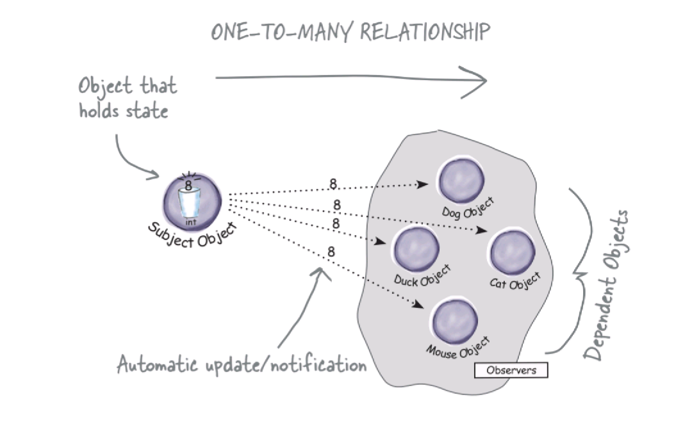
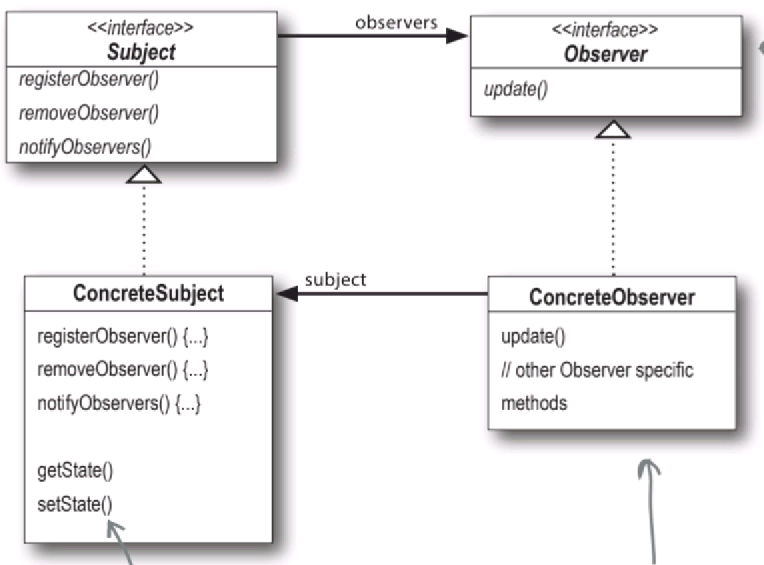
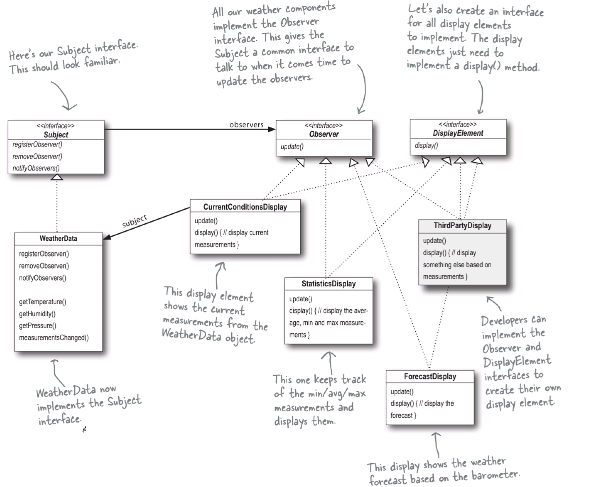
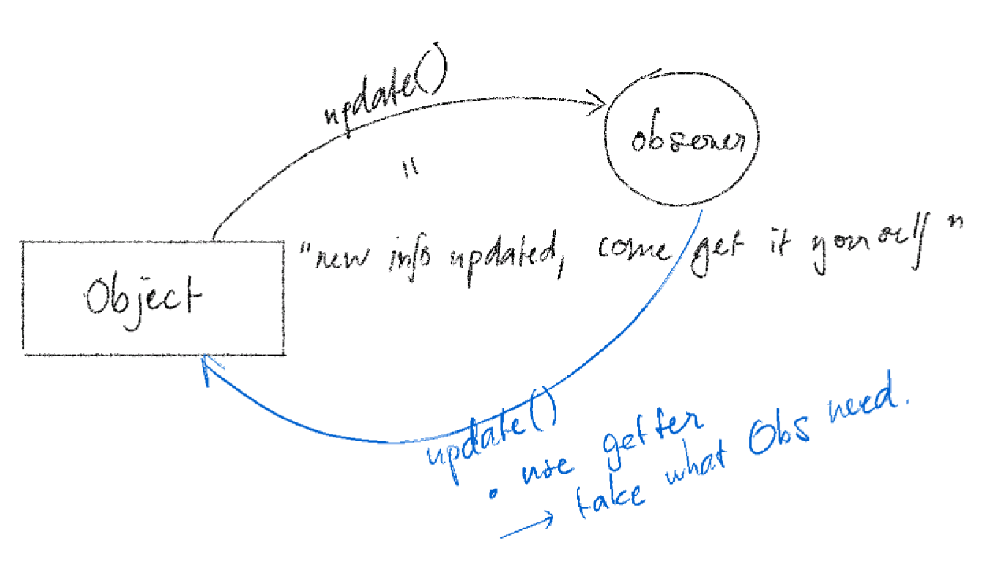

# Chapter 2: Observer Pattern

- Behavioral design pattern.
- Defines a one-to-many dependency between objects.

## The Observer Pattern

**Formal defintion:**
> *The Observer Pattern defines a one-to-many dependency between objects so that when one object changes state, all its dependents are notified and updated automatically.*



## Design principles

1. Strive for loosely coupled designs between objects that interact.

    **Observer Pattern** is all about **loose coupling**. The subject and observers are independent. The only thing the subject knows about an observer is that it implements a certain interface (Observer).

    

1. Encapsulate what varies.

    - Things that change: internal state of Subject (WeatherData) and the way that weather data is displayed (CurrentConditionsDisplay, StatisticsDisplay, ForecastDisplay).

1. Program to an interface, not an implementation.

    - The Subject and Observer interfaces define the interaction between the objects  
=> "loosely coupled"

1. Favor composition over inheritance.

    - The Observer Pattern uses composition to allow the Observer to be any object that implements the Observer interface.
    - No need to inherit from a super class. (subcribe/unsubscribes --> composition)

## The Weather Monitoring Application



## Generalize the Observer Pattern with pulling from the Subject

- **Push model:** The subject sends observers detailed information when a change occurs.
- **Pull model:** The subject sends basic information and observers query for detailed information.



1. create `update()` with no arguments. --> notify that there has been a change.

    ```cpp
    void notifyObservers() {
        for (auto observer : observers) {
            observer->update();
        }
    }
    ```

2. in Observer interface, add a method to get the state of the Subject.

    ```cpp
    virtual void update() = 0;
    ```

3. implement the `update()` method in the Observer class.

    ```cpp
    void update() {
        temperature = weatherData->getTemperature();
        humidity = weatherData->getHumidity();
        display();
    }
    ```

## Lambda Expressions

- Lambda expressions are a way to define a function in a single line of code.

```cpp
auto myLambda = [](int x, int y) { return x + y; };

int result = myLambda(3, 4); // result = 7
```

## Observer Pattern with Lambda Expressions

- We can use lambda expressions to implement the update() method of the Observer interface.

```cpp
auto currentDisplay = [this] {
    temperature = weatherData->getTemperature();
    humidity = weatherData->getHumidity();
    display();
};

auto statisticsDisplay = [this] {
    // ...
};

auto forecastDisplay = [this] {
    // ...
};

observers.push_back(currentDisplay);
observers.push_back(statisticsDisplay);
observers.push_back(forecastDisplay);

void notifyObservers() {
    for (auto observer : observers) {
        observer();  // call the lambda
    }
}
```

>*`auto` will automatically deduce the type of the lambda expression.*

Now, we don't need to create a new class for each display. We can use lambda expressions to implement the update() method of the Observer interface.
